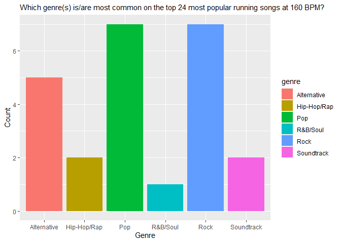

Goal
====

I want to be able to analyse the data on the most popular running songs
at 160 BPM, which are summarised on
<a href="https://jog.fm/workout-songs/at/160/bpm.160?order=desc&amp;sort=popularity" class="uri">https://jog.fm/workout-songs/at/160/bpm.160?order=desc&amp;sort=popularity</a>.

``` r
# loading libraries
pacman::p_load(rvest, tidyverse, janitor, statebins, ggplot2)
```

Scrape the data
---------------

Next, learn how scrape the content of the website and extract the HTML
table:

``` r
url <- "https://jog.fm/workout-songs/at/160/bpm.160?order=desc&sort=popularity"
# scrape the website
url_html <- read_html(url)
```

Since I could not get data extraction to work on a more general tag, I
decided to go to the cell level. Here, I extract individual cells from
the HTML table by using the most unique tags, I can find (e.g. “div.top”
for the artist, “div.title” for the song\_title, “div.meta” for the
genre) - and in some cases, I go (through piping) further into that tag
in order to get to a tag, which is not unique overall, but only in
combination with its former/parent tag. This creates a character element
out of each table cell, which is why I have to do some extra data
cleaning. See below

``` r
# Accessing the relevant information
artist <- url_html %>% 
    html_nodes("div.top") %>% 
    html_text(trim = FALSE)
head(artist)
```

    ## [1] "OutKast"           "Fall Out Boy"      "Jimmy Eat World"  
    ## [4] "Pharrell Williams" "Lenny Kravitz"     "The Romantics"

``` r
song_title <- url_html %>%
    html_nodes("div.title") %>%
    html_text(trim = FALSE)
head(song_title)
```

    ## [1] "Hey Ya!"                          "Sugar, We're Goin Down"          
    ## [3] "The Middle"                       "Happy (from \"Despicable Me 2\")"
    ## [5] "Fly Away"                         "What I Like About You"

``` r
genre <- url_html %>%
    html_nodes("div.meta") %>%
    html_nodes("a") %>% 
    html_text(trim = FALSE)
head(genre)
```

    ## [1] "Hip-Hop/Rap"  "Apple Music"  "Amazon Music" "Spotify"      "Alternative" 
    ## [6] "Apple Music"

``` r
BPM <- url_html %>%
    html_nodes("div.side-box.fixed") %>%
    html_nodes("div.middle") %>% 
    html_text(trim = FALSE)
head(BPM)
```

    ## [1] "160" "162" "162" "160" "160" "160"

``` r
pace <- url_html %>%
    html_nodes("div.side-box") %>%
    html_nodes("div.middle") %>% 
    html_text(trim = FALSE)
head(pace)
```

    ## [1] "160"  "5:36" "162"  "5:28" "162"  "5:28"

``` r
# Cleaning the strings with > 24 observations (there are only 24 songs on this page)
# genre
length(genre) # 4x as many observations
```

    ## [1] 96

``` r
genre # inspecting - and noticing that music services are here
```

    ##  [1] "Hip-Hop/Rap"  "Apple Music"  "Amazon Music" "Spotify"      "Alternative" 
    ##  [6] "Apple Music"  "Amazon Music" "Spotify"      "Alternative"  "Apple Music" 
    ## [11] "Amazon Music" "Spotify"      "Pop"          "Apple Music"  "Amazon Music"
    ## [16] "Spotify"      "Rock"         "Apple Music"  "Amazon Music" "Spotify"     
    ## [21] "Pop"          "Apple Music"  "Amazon Music" "Spotify"      "Pop"         
    ## [26] "Apple Music"  "Amazon Music" "Spotify"      "Pop"          "Apple Music" 
    ## [31] "Amazon Music" "Spotify"      "Rock"         "Apple Music"  "Amazon Music"
    ## [36] "Spotify"      "Alternative"  "Apple Music"  "Amazon Music" "Spotify"     
    ## [41] "Rock"         "Apple Music"  "Amazon Music" "Spotify"      "Rock"        
    ## [46] "Apple Music"  "Amazon Music" "Spotify"      "Hip-Hop/Rap"  "Apple Music" 
    ## [51] "Amazon Music" "Spotify"      "Rock"         "Apple Music"  "Amazon Music"
    ## [56] "Spotify"      "Pop"          "Apple Music"  "Amazon Music" "Spotify"     
    ## [61] "Rock"         "Apple Music"  "Amazon Music" "Spotify"      "Rock"        
    ## [66] "Apple Music"  "Amazon Music" "Spotify"      "Pop"          "Apple Music" 
    ## [71] "Amazon Music" "Spotify"      "R&B/Soul"     "Apple Music"  "Amazon Music"
    ## [76] "Spotify"      "Pop"          "Apple Music"  "Amazon Music" "Spotify"     
    ## [81] "Alternative"  "Apple Music"  "Amazon Music" "Spotify"      "Soundtrack"  
    ## [86] "Apple Music"  "Amazon Music" "Spotify"      "Alternative"  "Apple Music" 
    ## [91] "Amazon Music" "Spotify"      "Soundtrack"   "Apple Music"  "Amazon Music"
    ## [96] "Spotify"

``` r
# removing the irrelevant information
genre <- genre %>% .[.!="Apple Music" & .!="Spotify" & .!="Amazon Music"]

length(genre) # checking length again - now 24
```

    ## [1] 24

``` r
# pace
length(pace) # 2x as many observations
```

    ## [1] 48

``` r
pace # inspecting - and noticing that BPM are also here
```

    ##  [1] "160"  "5:36" "162"  "5:28" "162"  "5:28" "160"  "5:36" "160"  "5:36"
    ## [11] "160"  "5:36" "161"  "5:32" "160"  "5:36" "159"  "5:39" "162"  "5:28"
    ## [21] "160"  "5:36" "158"  "5:43" "160"  "5:36" "160"  "5:36" "160"  "5:36"
    ## [31] "159"  "5:39" "160"  "5:36" "160"  "5:36" "160"  "5:36" "160"  "5:36"
    ## [41] "158"  "5:43" "159"  "5:39" "158"  "5:43" "158"  "5:43"

``` r
# Extracting only the paces (pattern: one or two digits, colon, two digits)
pace <- pace %>% str_extract("\\d+:\\d{2}")
pace <- na.omit(pace) # removing NAs (the former BPMs)

length(pace) # checking length again - now 24
```

    ## [1] 24

``` r
# Putting data together in a dataframe
df_run <- tibble(artist, song_title, genre, BPM, pace)
df_run$BPM <- as.numeric(df_run$BPM) # making BPM numeric
```

Now I’m done with the scraping and have the data in a dataframe.

Visualisation!
--------------

What are the most common genres on the top 24 most popular running songs
at 160 BPM?

``` r
ggplot(df_run) +
    geom_bar(aes(x = genre, fill = genre)) +
    xlab("Genre") +
    ylab("Count") +
    labs(subtitle = "Which genre(s) is/are most common on the top 24 most popular running songs at 160 BPM?")
```


Based on this, it seems that pop, rock, and alternative music are the
most popular genres on the top 24 running hits at 160 BPM.
